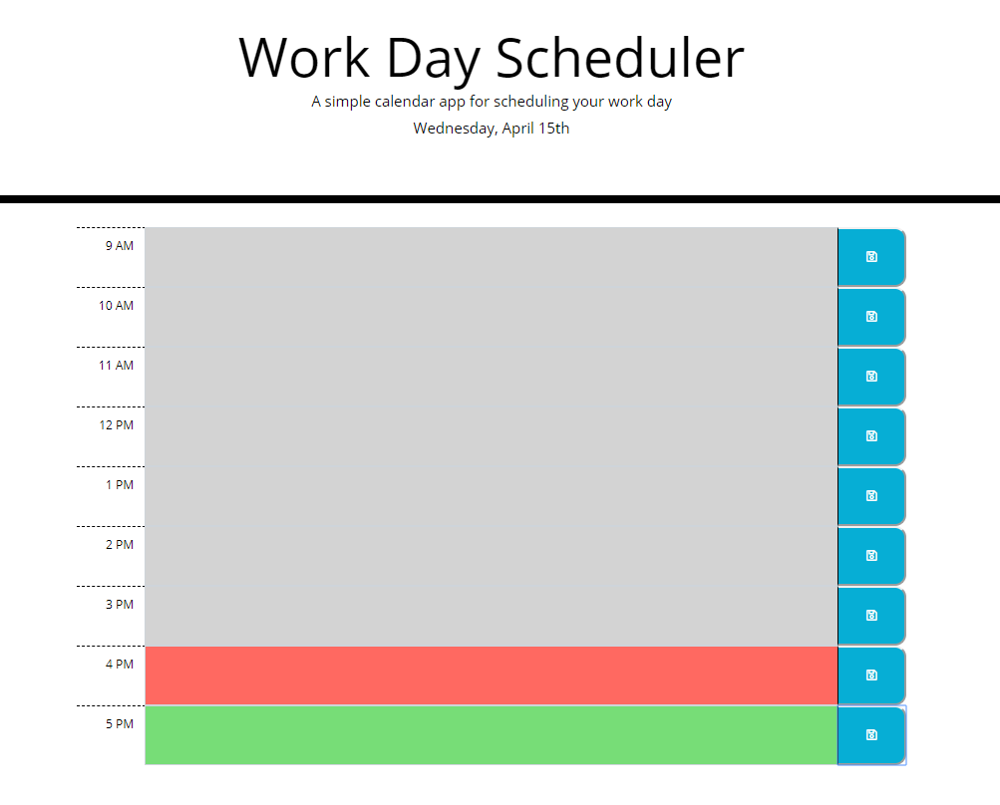

# Work Day Scheduler

Created a simple scheduling application that saves users day to local storage and allows them to store upcoming tasks. The hours change color depending on the time of day. 

Used jQuery and [Moment.js](https://momentjs.com/) library to work with the dates and times.

Application deployed at: https://jpd61.github.io/work-day-scheduler/

